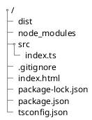

ありふれた内容なので、主に自分の勉強目的＆備忘録です。

↓↓より詳しくまとめてくださっている記事がありました↓↓

https://qiita.com/notakaos/items/3bbd2293e2ff286d9f49#2-git-%E5%88%9D%E6%9C%9F%E5%8C%96


- 動作環境
    - macOS 11.6.8
    - node v16.27.0
    - npm 8.15.0

# 初期化作業

## ディレクトリ作成＆移動
新規の空ディレクトリ（`typescript_sample`とする）を作成し、ディレクトリに移動します。

```bash
mkdir typescript_sample
cd typescript_sample
```

その下に`src`ディレクトリ、`dist`ディレクトリを作成します

```bash
mkdir dist
mkdir src
```

## package.jsonの生成

以下コマンドを実行します。

```bash
npm init -y
```

## Typescriptのインストール

```bash
npm install --save-dev typescript
```

## lite-serverのインストール

```bash
npm install --save-dev lite-server
```

## package.jsonの編集

```diff_json: package.json
{
  "name": "typescript_sample",
  "version": "1.0.0",
  "description": "",
  "main": "index.js",
  "scripts": {
-   "test": "echo \"Error: no test specified\" && exit 1"
+   "test": "echo \"Error: no test specified\" && exit 1",
+   "start": "lite-server"
  },
  "keywords": [],
  "author": "",
  "license": "ISC",
  "devDependencies": {
    "lite-server": "^2.6.1",
    "typescript": "^4.8.3"
  }
}

```

## .gitignoreの作成

以下の内容で`.gitignore`を作成します。

```.gitignore
node_modules
dist
```

## tsconfig.jsonの生成・編集

以下コマンドを実行すると、`tsconfig.json`が生成されます。
```bash
npx tsc --init
```

以下のように編集します。
```diff_json:tsconfig.json
{
  "compilerOptions": {
    /* Basic Options */

    //中略

    /* Modules */
    "module": "commonjs", /* Specify what module code is generated. */
-   // "rootDir": "./", /* Specify the root folder within your source files. */
+   "rootDir": "./src", /* Specify the root folder within your source files. */
    
    //中略
    
    // "outFile": "./",                                  /* Specify a file that bundles all outputs into one JavaScript file. If 'declaration' is true, also designates a file that bundles all .d.ts output. */
-   // "outDir": "./",                                   /* Specify an output folder for all emitted files. */
+   "outDir": "./dist", /* Specify an output folder for all emitted files. */
    // "removeComments": true,                           /* Disable emitting comments. */

    //中略

    /* Completeness */
    // "skipDefaultLibCheck": true,                      /* Skip type checking .d.ts files that are included with TypeScript. */
    "skipLibCheck": true                                 /* Skip type checking all .d.ts files. */
  },
+ "exclude": ["node_modules"]
}

```

## index.htmlの作成

以下の内容で作成します。

```html:./index.html
<!DOCTYPE html>
<html lang="ja">
  <head>
    <meta charset="UTF-8" />
    <meta name="viewport" content="width=device-width, initial-scale=1.0" />
    <meta http-equiv="X-UA-Compatible" content="ie=edge" />
    <title>typescript_sample</title>
    <script src="dist/index.js" defer></script>
  </head>
  <body>
    <h1>Hello</h1>
  </body>
</html>
```

## index.tsの作成

以下の内容で`src`ディレクトリの下に作成します。

```ts:src/index.ts
console.log("Hello")
```

## ディレクトリ構成

ここまで行うと以下のようなディレクトリ構成になっていると思います。



# 動かす

## コンパイラをウォッチモードで起動

```bash
npx tsc -w
```

## lite-serverを起動

新規ターミナルを開いて、以下で起動します。

```bash
npm start
```

## 動作確認

自動でブラウザが起動し、ページが表示されます。
ブラウザの開発者ツールを開くと、コンソールに文字（`Hello`）が出力されており、問題なく動作しています。


以上。

本記事のコードはGithubに上げています。

https://github.com/plumchang/typescript_sample

# その他

## 自動フォーマット（VSCode）

1. VSCodeの拡張機能である[Prettier](https://prettier.io/)をインストール
1. `Settings`から、`Editor: Default Formatter`で`Prettier`を選択します。
    

1. `Settings`から、`Editor: Format On Save`を有効にします。
    


