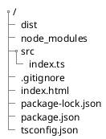

ありふれた内容なので、主に自分の勉強目的＆備忘録です（不正確な内容があるかもです）。

以前投稿した以下の記事では、`tsc`でTypeScriptコンパイル、`live-server`で開発用Webサーバを起動するサンプルプロジェクトを作成していました。

https://qiita.com/plumchang/items/a800be904936e86d6f44

`webpack`を利用することで、上記のようなことはまとめて実施可能ということなので、本記事では`webpack`を使ってTypeScriptを動かすまでを試します。

`webpack`はざっくり以下のような機能を提供するもの（という認識）です。
- 複数のJavaScriptソースを1つにバンドル
    - 依存関係（モジュールimport）の解決
    - ソースの軽量化(minify)が可能
- TypeScriptのコンパイル
- 開発用Webサーバの起動
    - ソース変更の検知と自動コンパイル


## 動作環境
- macOS : 11.7
- node : v16.27.0
- npm : 8.15.0
- webpack : 5.74.0
- typescript : 4.8.4


# 準備
ひとまず、ベースのプロジェクトとして、筆者が以前投稿した記事に沿って作成します（横着）。

https://qiita.com/plumchang/items/a800be904936e86d6f44

## ディレクトリ構成
作成しました。
ベースとなるプロジェクトは以下のようなディレクトリ構成になっています。



# webpackの導入

ペースのプロジェクトを元に作業していきます。

## インストール
以下でインストールします。

```bash
npm install --save-dev webpack webpack-cli webpack-dev-server ts-loader typescript
```

ここでインストールしたもののざっくりとした説明です。
- webpack : webpack本体
- webpack-cli : webpackのCLI（コマンドセット）
- webpack-dev-server : webpackの開発用Webサーバ
- ts-loader : TypeScriptをJavaScriptに変換するloader
- typescript : TypeScript（念の為、改めてインストールしています）

## webpack.config.js の作成

ディレクトリトップに`webpack.config.js`を以下の内容で作成します。

```js:./webpack.config.js
const path = require("path");

module.exports = {
  mode: "development",
  entry: "./src/index.ts",
  output: {
    filename: "index.js",
    path: path.resolve(__dirname, "dist"),
    publicPath: "/dist",
  },
  devServer: {
    static: [
      {
        directory: path.resolve(__dirname, "dist"),
        publicPath: "/dist",
      },
      {
        directory: path.resolve(__dirname),
        publicPath: "/",
      },
    ],
  },
  devtool: "eval",
  module: {
    rules: [
      {
        test: /\.ts$/,
        loader: "ts-loader",
        exclude: /node_modules/,
      },
    ],
  },
  resolve: {
    extensions: [".ts", ".js"],
  },
};
```

`webpack.config.js`の記載方法については、公式のドキュメントに一通り載っています。

https://webpack.js.org/configuration/

が、一応、上記の設定で記載しているところをざっくりまとめておくと、

- `mode` : ビルドのデフォルト設定
　`development` : 開発モード（ソースマップ生成、ソース軽量化なし、etc.）
　`production` : 本番モード（ソースマップ生成なし、ソース軽量化、etc..）
　`none` : デフォルト設定なし
- `entry` : ビルド時のバンドルプロセスの開始点（指定したファイルから依存関係を探索する）
- `output` : 出力設定
    - `filename` : バンドル後のファイル名
    - `path` : 出力先ディレクトリパス（絶対パスで指定が必要）
    - `publicPath` : 本番ビルド時のHTML等が、バンドル後のファイルを参照するためのURL（の相対パス）
- `devServer` : webpack-dev-serverの設定
    - `static` : 静的ファイルの設定
        - `directory` : 配布する静的ファイルのディレクトリパス（絶対パス推奨）
        - `publicPath` : ↑の`directory`を参照するためのURL（の相対パス）
- `devtool` : 開発時のデバック等に利用するソースマップの設定（ビルド時のパフォーマンスに影響する）
　`eval` : 開発モードでの推奨設定の1つ。比較的高速だが、行番号の対応が間違う場合がある。
　`false` : 本番モードでの推奨設定の1つ。ソースマップ生成をしないため、最も高速。
　その他、様々オプションがあるが、ここでは割愛。
- `module` : モジュール設定
    - `rules` : 主にloaderの設定（JavaScript以外のモジュールをJavaScriptに変換するためのルール）
        - `test` : loaderを適用するファイルの指定（正規表現）
        - `loader` : 適用するloader
        - `exclude` : loader適用から除外するファイル・ディレクトリ（絶対パス推奨）
- `resolve` : モジュール依存関係の解決に関する設定
    - `extensions` : モジュールの拡張子（の配列）。
    　配列の先頭から優先的に処理される。
    　例えば、`extensions: [".ts", ".js"]`の設定で、`import Hoge from "./hoge"`と書いた場合は、`hoge.ts`→`hoge.js`の順に探索されます。

## tsconfig.jsonの編集

`rootDir`は、同様の設定を↑の`webpack.config.js`で行っているため、コメントアウトします。

```diff_json:./tsconfig.json
{
  "compilerOptions": {
    //<中略>

    /* Modules */
    "module": "commonjs",                                /* Specify what module code is generated. */
-   "rootDir": "./src",                                  /* Specify the root folder within your source files. */
+   // "rootDir": "./src",                                  /* Specify the root folder within your source files. */
    // "moduleResolution": "node",                       /* Specify how TypeScript looks up a file from a given module specifier. */

    //<中略>
  },
  "exclude": ["node_modules"]
}
```

## package.jsonの編集

`npm start`で実行するコマンドを、`lite-server`から`webpack serve ~~`に変更します。

なお、`webpack serve`コマンドはwebpack v5系以降でのコマンドであり、v4以前では`webpack-dev-server`コマンドを利用するとのことです。

```diff_json:./package.json
{
  "name": "typescript_webpack_sample",
  "version": "1.0.0",
  "description": "",
  "main": "index.js",
  "scripts": {
    "test": "echo \"Error: no test specified\" && exit 1",
-   "start": "lite-server"
+   "start": "webpack serve --mode development --config webpack.config.js"
  },

　　　　//<中略>
}
```

## 動作確認

`npm start`で実行して確認します。
デフォルトでは、http://localhost:8080 でサーバが起動するので、ブラウザでアクセスします。


問題なくページが表示されました。
`lite-server`を利用した場合は、ソース変更を検知するために別コンソールで`npx tsc -w`を実行しておく必要がありましたが、webpackの場合は不要です。

試しに、`index.ts`を編集します。
```diff_typescript:src/index.ts
- console.log("Hello")
+ console.log("Hello webpack")
```
ちゃんとページの方へ反映されました。


# 複数ソースのバンドル

これだけだと物足りないので、複数ソースを1つにバンドルしてくれる機能も試します（おそらくこちらの方がwebpackのメイン機能です）。

tsのソースを追加・修正します。
- 修正：index.ts
```typescript:./src/index.ts
import { sampleFunc } from "./sample-func";

sampleFunc();
```
- 追加：sample-func.ts
```typescript:./src/sample-func.ts
import { sampleFunc2 } from "./sample-func2";

export function sampleFunc() {
  console.log("やぁ");
  sampleFunc2();
}
```
- 追加：sample-func2.ts
```typescript:./src/sample-func2.ts
export function sampleFunc2() {
  console.log("Hi");
}
```
`index.ts`→`sample-func.ts`→`sample-func2.ts`というようなモジュール依存関係ができました。

`webpack.config.js`と`index.html`を修正します。
分かりやすさのため、バンドル後のファイル名を変更しているだけなので、必須の作業ではありません。
```diff_javascript:./webpack.config.js
const path = require("path");

module.exports = {
  mode: "development",
  entry: "./src/index.ts",
  output: {
-   filename: "index.js",
+   filename: "bundle.js",
    path: path.resolve(__dirname, "dist"),
    publicPath: "/dist",
  },
//<中略>
  resolve: {
    extensions: [".ts", ".js"],
  },
};
```

```diff_html:./index.html
<!DOCTYPE html>
<html lang="ja">
  <head>
    <meta charset="UTF-8" />
    <meta name="viewport" content="width=device-width, initial-scale=1.0" />
    <meta http-equiv="X-UA-Compatible" content="ie=edge" />
    <title>typescript_sample</title>
-   <script src="dist/index.js" defer></script>
+   <script src="dist/bundle.js" defer></script>
  </head>
  <body>
    <h1>Hello</h1>
  </body>
</html>

```

## 動作確認

`npm start`で開始して動作を確認します。
コンソールに今回追加した文字列が出力されているので、問題なく動作しているように見えます。


バンドルされたソースを見てみます。
ちゃんと、`bundle.js`という１つのファイルにバンドルされています。
※webpack-dev-serverでは、バンドル後のファイルはメモリ上に持つようなので、プロジェクト内にファイルが作成されるわけではありません。

ソースのダウンロード回数が減るため、基本的にはバンドルをした方がパフォーマンスが良くなるようです。ただ、バンドル後のソースサイズにも影響されるため、絶対とは言い切れない模様。


今記事で作成したサンプルプロジェクトはGitHubにアップしています。

https://github.com/plumchang/typescript_webpack_sample

以上。

# 参考
- webpack公式

https://webpack.js.org/
